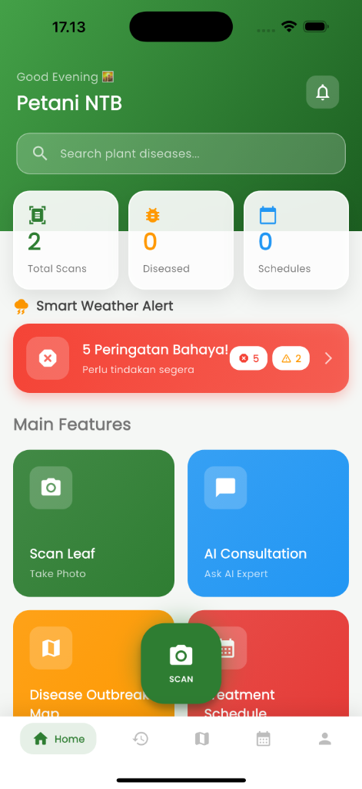
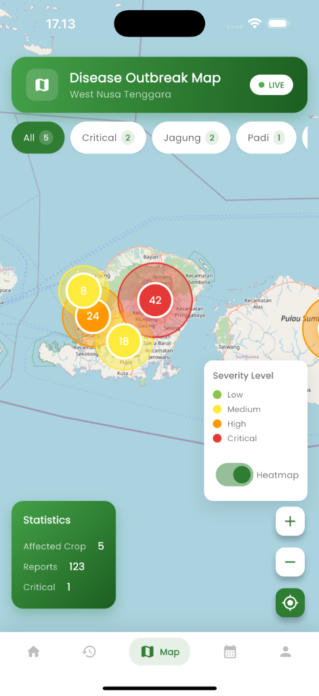
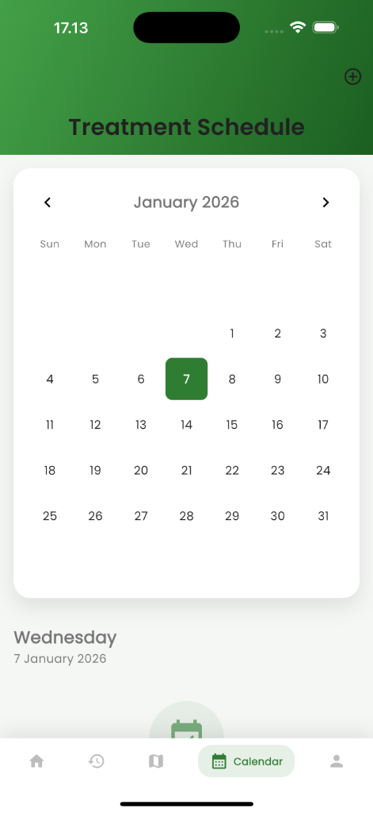
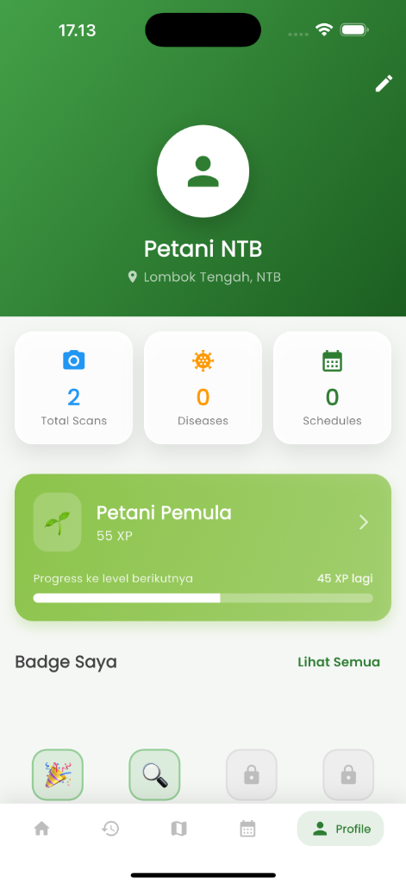

<p align="center">
  
</p>

<h1 align="center">AgriVision NTB</h1>

<p align="center">
  <strong>Smart Plant Disease Detection for Farmers in West Nusa Tenggara</strong>
</p>

<p align="center">
  <a href="#features">Features</a> •
  <a href="#screenshots">Screenshots</a> •
  <a href="#tech-stack">Tech Stack</a> •
  <a href="#getting-started">Getting Started</a> •
  <a href="#documentation">Documentation</a>
</p>

<p align="center">
  
  
  
  
</p>

---

## About

**AgriVision NTB** is an AI-powered mobile application designed to help farmers in **Nusa Tenggara Barat (NTB), Indonesia** detect, analyze, and treat plant diseases using modern technology. The app combines **Azure Custom Vision** for disease classification and **Azure OpenAI** for intelligent consultation, making agricultural expertise accessible to every farmer.

> *"Petani Cerdas, Pertanian Sehat"* — Smart Farmers, Healthy Agriculture

---

## Features

| Feature | Description |
|---------|-------------|
| **Disease Detection** | Scan plant leaves using camera to detect diseases with AI |
| **AI Consultation** | Chat with AI agronomist for treatment recommendations |
| **Outbreak Map** | Interactive heatmap showing disease spread across NTB |
| **Treatment Calendar** | Schedule and track spraying, fertilizing, and harvest |
| **Weather Dashboard** | Real-time weather with farming recommendations |
| **Disease Encyclopedia** | Database of 80+ plant diseases with treatments |
| **Plant Guide** | Cultivation guide for 10 main crops in NTB |
| **Pesticide Finder** | Find recommended pesticides with local shop locations |
| **Gamification** | Earn XP and badges to encourage best practices |
| **Offline Mode** | Core features work without internet connection |

### Language Support

The app supports 5 languages to serve the diverse communities in NTB:

- 🇮🇩 **Bahasa Indonesia** — National language
- 🇬🇧 **English** — International access
- 🏝️ **Bahasa Sasak** — Lombok native language
- 🏝️ **Bahasa Sumbawa** — Sumbawa native language
- 🏝️ **Bahasa Mbojo** — Bima native language

---

## Screenshots

<p align="center">
  
  
  
  
  
</p>

<p align="center">
  <em>From left to right: Home Dashboard, Disease Outbreak Map, Treatment Calendar, Scan History, User Profile</em>
</p>

---

## Tech Stack

### Mobile Application (Frontend)

| Technology | Purpose |
|------------|---------|
| **Flutter 3.x** | Cross-platform mobile framework |
| **Provider** | State management |
| **Easy Localization** | Multi-language support (5 languages) |
| **Flutter Map** | Interactive outbreak mapping |
| **Camera/Image Picker** | Plant leaf scanning |
| **SharedPreferences** | Local data persistence |

### Backend Services

| Technology | Purpose |
|------------|---------|
| **FastAPI** | Python REST API server |
| **OpenCV** | Image processing & severity analysis |
| **NumPy** | Numerical computing |

### Microsoft Azure Services

| Service | Purpose |
|---------|---------|
| **Azure Custom Vision** | Plant disease classification model |
| **Azure OpenAI (GPT-4)** | AI consultation chatbot |

---

## Architecture

```
agrivision_ntb/
│
├── lib/                      # Flutter Application
│   ├── config/               # App configuration
│   ├── models/               # Data models (11 models)
│   ├── providers/            # State management
│   ├── screens/              # UI screens (18 screens)
│   ├── services/             # API & device services
│   └── widgets/              # Reusable components
│
├── backend/                  # Python Backend
│   ├── main.py               # FastAPI server
│   └── requirements.txt      # Python dependencies
│
├── assets/
│   ├── translations/         # i18n files (5 languages)
│   ├── content/              # Disease & plant data
│   └── images/               # Static images
│
└── docs/                     # Documentation
    ├── MODELS.md             # Data model documentation
    └── SCREENS.md            # Screen documentation
```

---

## Getting Started

### Prerequisites

- Flutter SDK 3.x
- Python 3.9+
- Azure account (for AI services)

### Frontend Setup

```bash
# Clone the repository
git clone https://github.com/yourusername/agrivision-ntb.git
cd agrivision-ntb

# Install Flutter dependencies
flutter pub get

# Create environment file
cp .env.example .env
# Edit .env with your Azure API keys

# Run the application
flutter run
```

### Backend Setup

```bash
# Navigate to backend directory
cd backend

# Create virtual environment
python -m venv venv
source venv/bin/activate  # On Windows: venv\Scripts\activate

# Install dependencies
pip install -r requirements.txt

# Run the server
uvicorn main:app --reload --host 0.0.0.0 --port 8000
```

---

## Environment Variables

Create a `.env` file in the root directory:

```env
# Azure Custom Vision
CUSTOM_VISION_ENDPOINT=your_endpoint
CUSTOM_VISION_PREDICTION_KEY=your_key
CUSTOM_VISION_PROJECT_ID=your_project_id
CUSTOM_VISION_PUBLISHED_NAME=your_iteration_name

# Azure OpenAI
AZURE_OPENAI_ENDPOINT=your_endpoint
AZURE_OPENAI_KEY=your_key
AZURE_OPENAI_DEPLOYMENT_NAME=gpt-4o
```

> ⚠️ **Security Note**: Never commit `.env` file to version control. The `.gitignore` already excludes it.

---

## Documentation

| Document | Description |
|----------|-------------|
| [MODELS.md](docs/MODELS.md) | Comprehensive data model documentation (11 models, 80+ diseases) |
| [SCREENS.md](docs/SCREENS.md) | UI screen documentation (18 screens) |
| [Backend README](backend/README.md) | Backend API documentation |

---

## Data Models

AgriVision NTB includes **11 comprehensive data models**:

| Model | Records | Description |
|-------|---------|-------------|
| Disease | 80 | Plant diseases database |
| Plant | 10 | Main crops in NTB |
| Pesticide | 20 | Available treatments |
| Weather | - | Weather & farming recommendations |
| Farm | - | Farm management |
| ScanResult | - | Disease scan results |
| Prediction | - | AI outbreak predictions |
| AgroShop | 12 | Local agricultural shops |

---

## Contributing

Contributions are welcome! Please feel free to submit a Pull Request.

1. Fork the repository
2. Create your feature branch (`git checkout -b feature/AmazingFeature`)
3. Commit your changes (`git commit -m 'Add some AmazingFeature'`)
4. Push to the branch (`git push origin feature/AmazingFeature`)
5. Open a Pull Request

---

## Team

**AgriVision NTB Team** — Microsoft Imagine Cup 2026

---

## License

This project is licensed under the MIT License - see the [LICENSE](LICENSE) file for details.

---

<p align="center">
  Made with ❤️ for farmers in Nusa Tenggara Barat
</p>
